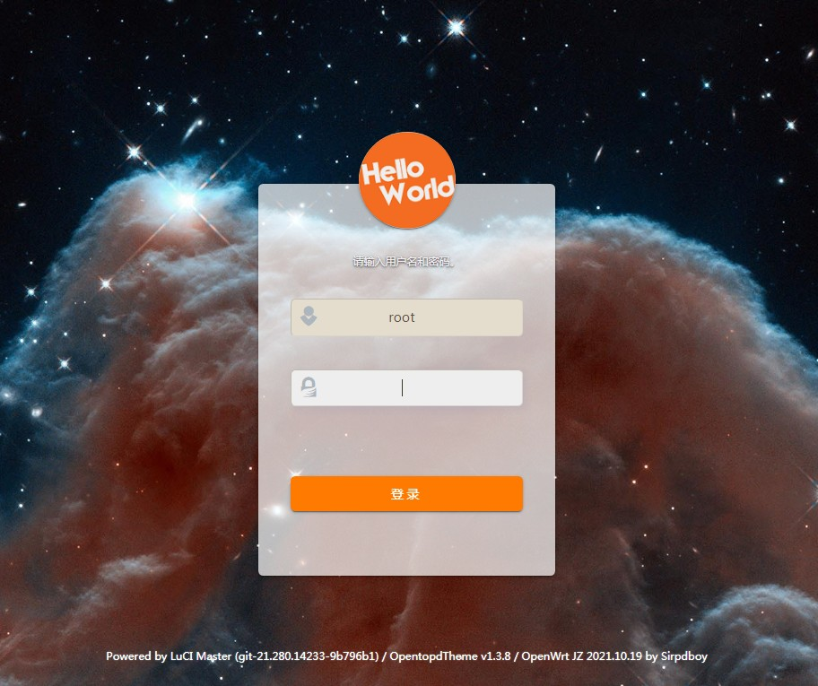
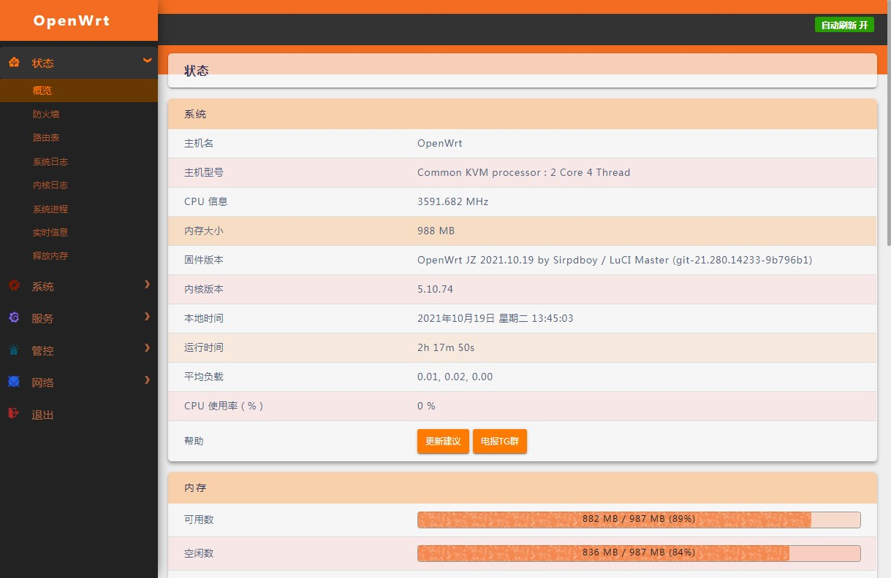
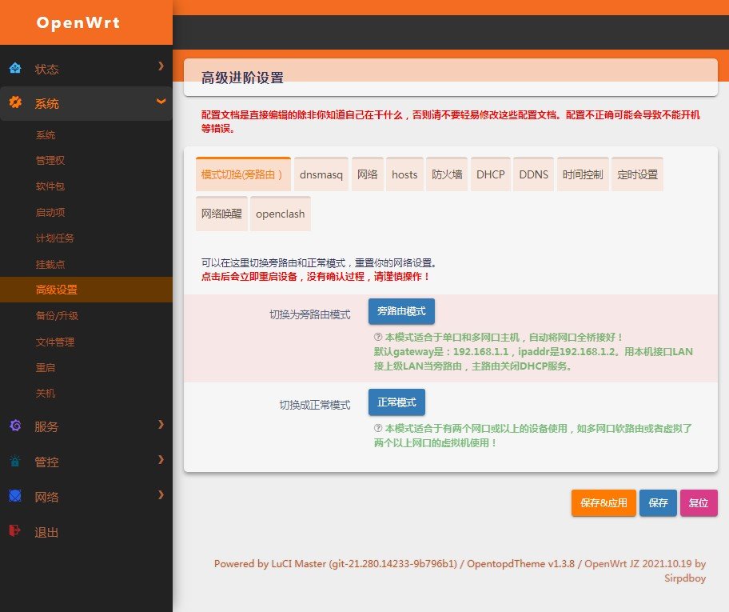
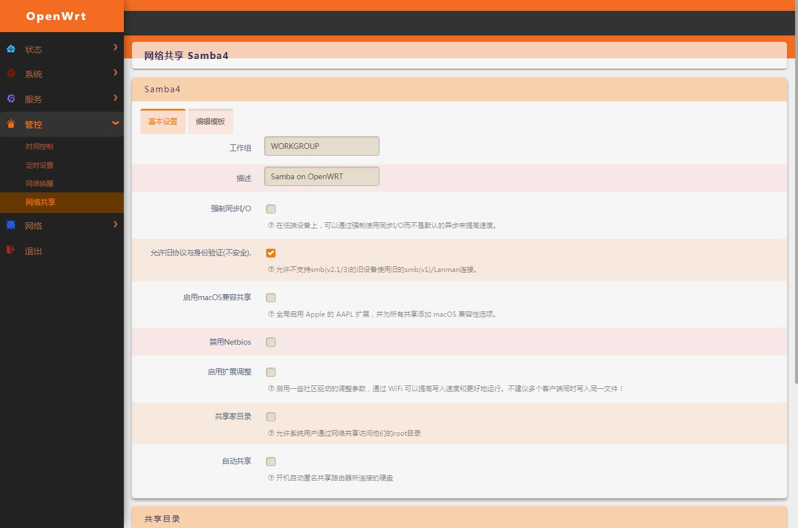
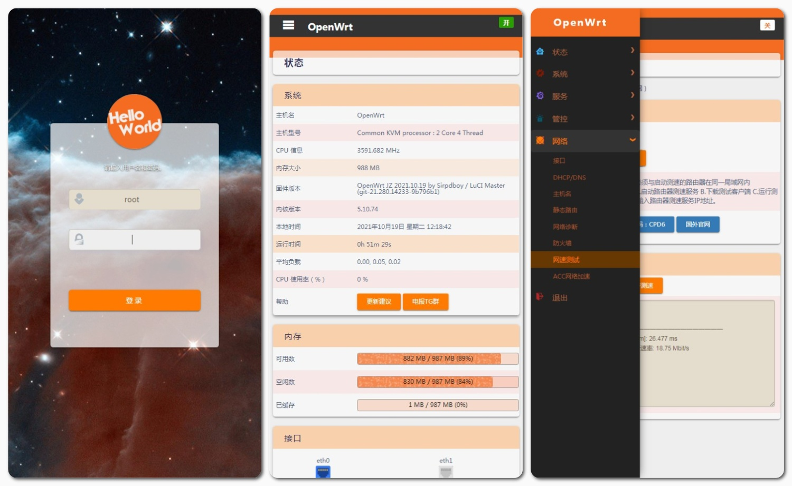

[](#解决-github-网页上图片显示失败的问题) [](https://t.me/joinchat/AAAAAEpRF88NfOK5vBXGBQ)
<a href="#readme">
    
</a>

<h1 align="center">
  <br>luci-theme-opentopd<br>
</h1>

<p align="center">
<a href="https://openwrt.org"></a>
<a href="https://www.google.com/chrome/"></a>
<a href="https://www.apple.com/safari/"></a>
<a href="https://www.mozilla.org/firefox/"></a>
<a target="_blank" href="https://github.com/sirpdboy/luci-theme-opentopd/releases"> </a>
<a href="https://github.com/sirpdboy/luci-theme-opentopd/releases"></a>
</p>


[luci-theme-opentopd  thme openwrt主题](https://github.com/sirpdboy/luci-theme-opentopd)


[](#readme) [](#编译说明-) [](#捐助-) 

请 **认真阅读完毕** 本页面，本页面包含注意事项和如何使用。

opentopd是一款基于luci-theme-material构建,使用HTML5、CSS3编写的Luci主题。
-

## 写在前面：

    这个主题是为sirpdboy（基于OpenWrt，专门为家庭使用场景设计的固件）专门设计的，也可以用于OpenWrt其他版本.
	
	目前兼容Luci18，Luci其他版本计划在此版本稳定后开发。

## 编译说明 [](#编译说明-) 

将opentopd 主题添加至 LEDE/OpenWRT 源码的方法。

更新日志：

2021.12.15  opentopd  1.4.7

	     1、修复偶尔加载页面会白屏问题

	     2、取消加载动画
	     
	     3、优化升级固件页面布局
	     
	     4、修复已知所有BUG。
	     
2021.11.19  opentopd  1.4.2

	     1.改回菜单自动收缩功能，方便手机操作菜单。
	     
	     2.修复网卡LAN口收缩问题
	     
	     3.进一步优化背景等待时间，优化一些重复代码。
	     
2021.11.15  opentopd  1.4.1

	     1.优化装载背景，加快装载速度.
	     
	     2.更改进度条图片和背景等图片,使之更美观。
	     
	     3.压缩图片文件和LOGO图片大小，使之占用更小的空间。原LOGO图片120k,压缩后1.9K;原ICO图片66K，压缩后4.8K;原进度条图片6.4K，压缩后不到1/4K;登陆背景图片原来4000K，压缩后290K.全部文件大小只占用490K左右。

2021.11.10： opentopd 1.4.0

             1.  加入在线动态壁纸功能
	     
	     2.  自定义壁纸目录在/www/luci-static/opentopd/background/ 拷入图片后随机选择一张。

2021.10.19： opentopd 1.3.9

            1.优化UI，更精致。
	    
	    2.修复LAN口修改配置收缩的BUG。
	    
	    3.优化登陆窗口，手机上登陆更美观。

2021.10.18： opentopd 1.3.8  

            1.取消自动更新壁纸。
	    
	    2.修复HELLOWORLD被档住应用无法点击按钮问题。
	    
	    3.修复新版按钮选择无箭头问题。
	    
	    4.全新整理优化UI，使之更适合手机操控。
	    
2021.10.16： opentopd 1.3.6  

            1.取消自动更新壁纸问题。
	    
	    2.专项优化手机浏览布局等不合理问题，目前测试所有功能完美手机操控。
	    
2021.9.19： opentopd 1.3.0  

            1、美化登陆窗口。
	    
	    2、修复AdGuard Home 下载链接文本框太小的问题。
	    
	    3、修复插件多个项目超出后隐藏看不到问题。
	    
	    4、优化背景图主题占用空间更少.
	    
2020.5.25： opentopd 1.2.4 更新背景等
	    
2019.10.5： opentopd 1.0.0 在前人大神的基础上，自制字体发布首版本。

## 下载源码方法一：
编辑源码文件夹根目录feeds.conf.default并加入如下内容:

```Brach
    # feeds获取源码：
    src-git opentopd  https://github.com/sirpdboy/luci-theme-opentopd
 ``` 
  ```Brach
   # 更新feeds，并安装主题：
    scripts/feeds update opentopd
	scripts/feeds install luci-theme-opentopd
 ``` 	

## 下载源码方法二：
 ```Brach
    # 下载源码
    
    git clone https://github.com/sirpdboy/luci-theme-opentopd package/luci-theme-opentopd
    
    make menuconfig
 ``` 
## 配置菜单
 ```Brach
    make menuconfig
	# 找到 LuCI -> Themes, 选择 luci-theme-opentopd, 保存后退出。
 ``` 
## 编译
 ```Brach 
    # 编译固件
    make package/luci-app-opentopd/{clean,compile} V=s
 ```






## 说明 [](#说明-)

源码来源：https://github.com/sirpdboy/luci-theme-opentopd


### 你可以随意使用其中的源码，但请注明出处。


## 使用与授权相关说明
 
- 本人开源的所有源码，任何引用需注明本处出处，如需修改二次发布必告之本人，未经许可不得做于任何商用用途。


# My other project

- 网络速度测试 ：https://github.com/sirpdboy/NetSpeedTest

- 定时设置插件 : https://github.com/sirpdboy/luci-app-autotimeset

- 关机功能插件 : https://github.com/sirpdboy/luci-app-poweroffdevice

- opentopd主题 : https://github.com/sirpdboy/luci-theme-opentopd

- kucat 主题: https://github.com/sirpdboy/luci-theme-kucat

- 家长控制: https://github.com/sirpdboy/luci-theme-parentcontrol

- 系统高级设置 : https://github.com/sirpdboy/luci-app-advanced

- ddns-go动态域名: https://github.com/sirpdboy/luci-app-ddns-go

- 进阶设置（系统高级设置+主题设置kucat/agron/opentopd）: https://github.com/sirpdboy/luci-app-advancedplus

- 设置向导: https://github.com/sirpdboy/luci-app-wizard

- 分区扩容: https://github.com/sirpdboy/luci-app-partexp

- lukcy大吉: https://github.com/sirpdboy/luci-app-lukcy

## 捐助


|       |    | 
| :-----------------: | :-------------: |
| |  |

<a href="#readme">
    
</a>
